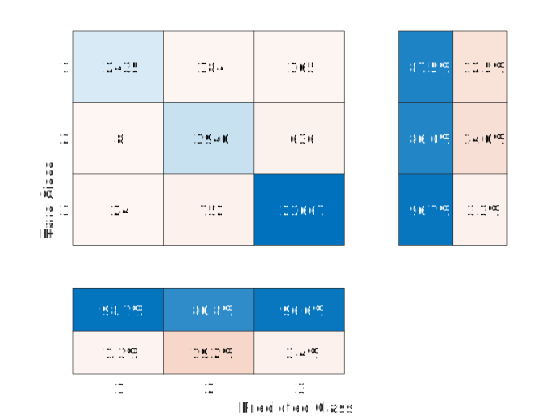
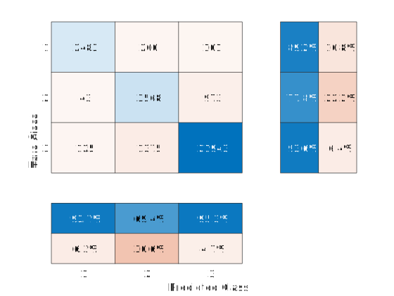

# Darknet traffic classification

This MATLAB project uses two different neural networks to classify Darknet traffic samples into three classes: `Tor`, `VPN` and `Benign (Non-Tor + NonVPN)`.

## Dataset

The `datasets` directory contains two datasets in the CSV format:

- `Darknet.csv` - also known as [CIC-Darknet2020](https://www.kaggle.com/datasets/peterfriedrich1/cicdarknet2020-internet-traffic)
- `Darknet_preprocessed.csv` - preprocessed dataset

In order to generate the preprocessed dataset and to get the label distribution, run `data_preprocessing/main.m`.

### Selected features

From the dataset, only 28 features were considered:

<table>
  <tr><td>Average Packet Size</td><td>FIN Flag Count</td><td>Fwd Packets/s</td><td>Packet Length Mean</td></tr>
  <tr><td>Bwd Init Win Bytes</td><td>Flow Duration</td><td>Fwd Segment Size Avg</td><td>Packet Length Std</td></tr>
  <tr><td>Bwd Packet Length Max</td><td>Flow IAT Max</td><td>Fwd Seg Size Min</td><td>Packet Length Variance</td></tr>
  <tr><td>Bwd Packet Length Mean</td><td>Flow IAT Mean</td><td>Idle Max</td><td>Protocol</td></tr>
  <tr><td>Bwd Packet Length Min</td><td>Flow IAT Min</td><td>Idle Mean</td><td>Subflow Bwd Bytes</td></tr>
  <tr><td>Bwd Packets/s</td><td>Fwd Header Length</td><td>Idle Min</td><td>Subflow Fwd Packets</td></tr>
  <tr><td>Bwd Segment Size Avg</td><td>FWD Init Win Bytes</td><td>Packet Length Max</td><td>Total Length of Bwd Packet</td></tr>
</table>

### Data normalization

Data underwent normalization within the range of `[-1, 1]` using the Z-Score, which measures the distance of a data point from the mean in terms of the standard deviation, preserving the shape properties of the original data.

### Data balancing

Due to the notable scarcity of `Tor` samples in comparison to other types of traffic, it was performed data augmentation by utilizing the SMOTE (Synthetic Minority Over-sampling Technique) [function](https://github.com/dkbsl/matlab_smote). This allows a more representative dataset with diverse and abundant samples from each class to avoid overfitting.

### Data splitting

Data was divided into three subsets:

<table>
  <tr><th></th><th>Non-Tor</th><th>NonVPN</th><th>VPN</th><th>Tor</th></tr>
  <tr><td>Training (60%)</td><td>56,014</td><td>14,318</td><td>13,751</td><td>8,352</td></tr>
  <tr><td>Validation (20%)</td><td>18,671</td><td>4,773</td><td>4,584</td><td>2,784</td></tr>
  <tr><td>Testing (20%)</td><td>18,671</td><td>4,772</td><td>4,584</td><td>2,784</td></tr>
  <tr><td>Total</td><td>93,356</td><td>23,863</td><td>22,919</td><td>13,920</td></tr>
</table>

## Models

### Multilayer Perceptron (MLP)

Comprises an input layer with 28 nodes, corresponding to the number of features, and two hidden layers with 5 nodes each. Lastly, the output layer is composed of 3 nodes. The training of this model employed the Levenberg-Marquardt backpropagation algorithm, with the mean squared error (MSE) utilized as the performance metric to assess the network's performance in a parallel execution environment.

### Convolutional Neural Network (CNN)

Composed by an input layer where each input sample has a height of 28 pixels, a width of 1 pixel, and a single channel (grayscale). It also comprises a convolutional layer and a rectified linear unit (ReLU) activation function which is applied element-wise to the output of the convolutional layer. The mentioned structured is then followed by three fully connected layers where the first 2 layers have 5 neurons each, while the last fully connected layer consists of 3 neurons, corresponding to the number of output classes. A softmax layer was added to convert the outputs of the previous fully connected layer into a probability distribution over the classes. The last stage of the model is a classification layer that assigns the predicted class based on the highest probability from the softmax layer. This model was trained using the training subset, with the assistance of the Adam optimizer. The training was conducted for a maximum of 8 epochs, with a mini-batch size of 256 in a parallel execution environment.

## Experiments

Running `mlp/main.m` and/or `cnn/main.m` will do the following:

- Read `datasets/Darknet_preprocessed.csv` and split the data into training, validation and testing subsets.
- Create and train the MLP/CNN model, respectively.
- Generate the confusion matrix after feeding the testing subset.

## Results

The results from the experiments are presented below in the form of confusion matrices, 
showcasing the performance of the Multilayer Perceptron (left) and the Convolutional Neural Network (right):

  
&nbsp; &nbsp; &nbsp; &nbsp;
  

### Performance

The evaluation metrics used to assess the performance of the modelscan be seen in the table below:

<table>
  <tr><th>Metric</th><th>Equation</th><th>MLP</th><th>CNN</th></tr>
  <tr><td>Accuracy</td><td>(TP + TN)/(TP + FP + TN + FN)</td><td>0.94</td><td>0.91</td></tr>
  <tr><td rowSpan="3">Precision</td><td rowSpan="3">TP/(TP + FP)</td><td>0.87</td><td>0.89</td>
  <tr><td>0.86</td><td>0.78</td></tr>
  <tr><td>0.97</td><td>0.94</td></tr>
  <tr><td rowSpan="3">Recall</td><td rowSpan="3">TP/(TP + FN)</td><td>0.99</td><td>0.94</td>
  <tr><td>0.81</td><td>0.69</td></tr>
  <tr><td>0.97</td><td>0.95</td></tr>
  <tr><td rowSpan="3">F1</td><td rowSpan="3">2TP/(2TP + FP + FN)</td><td>0.93</td><td>0.91</td></tr>
  <tr><td>0.83</td><td>0.73</td></tr>
  <tr><td>0.97</td><td>0.94</td></tr>
</table>

*TP: True Positive, TN: True Negative, FP: False Positive, FN: False Negative*